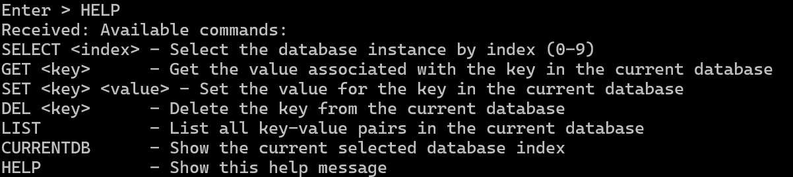
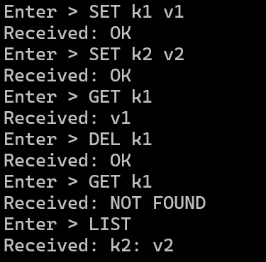
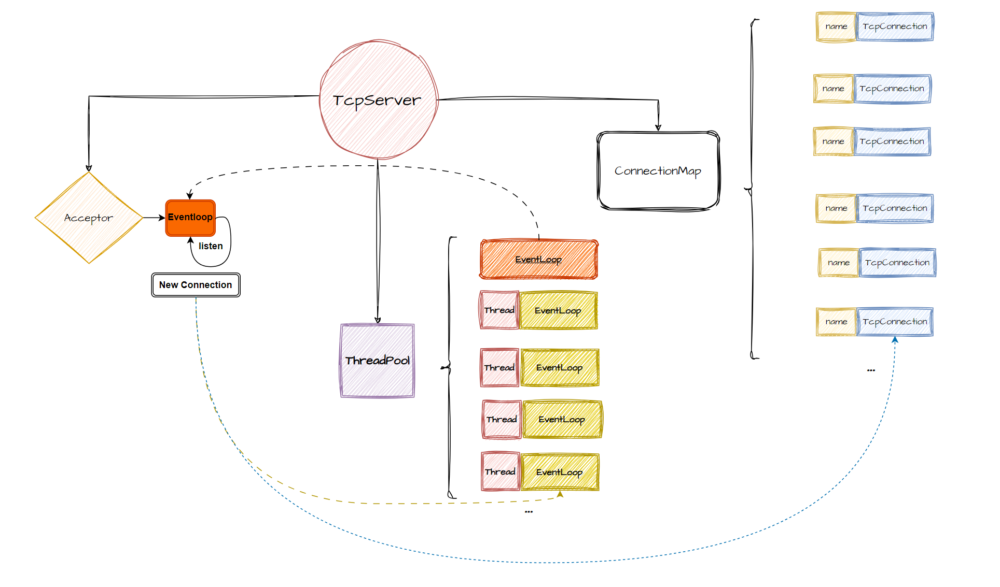
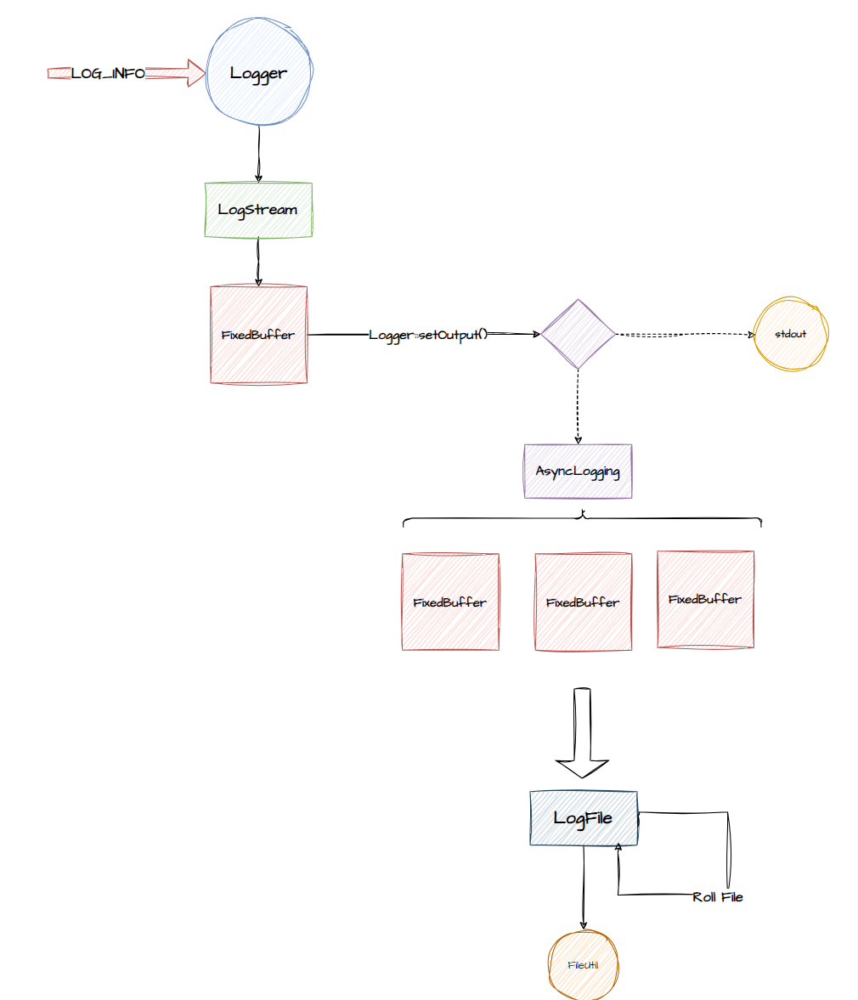

# Bamboo--KV网络服务器
Linux下C++轻量级键值对数据库服务器与客户端

在学习和参考Muduo网络库的基础上，重点实现了**网络模块** 和**日志模块**

存储模块调用了第三方库Leveldb

* 网络模块：实现了**One Loop Per Thread**的Multi Reactors模式 
其中Main Reactor负责监听新连接并分发给线程池中的Sub Reactors进行进一步处理。
* I/O优化：采用了**Epoll**机制结合非阻塞IO，以LT模式监听套接字。 
利用Buffer多次读取消息，实现了低延迟的消息读取。
* 内存管理：通过智能指针实现了资源的**RAII**管理， 
并解决了 TcpConnection 中存在的**循环引用**和**共享**问题，确保了资源的安全与高效使用。
* 线程间通信：引入**回调函数队列**，多线程协作处理网络事件；通过**eventfd**与多路复用相结合，实现了高效的跨线程唤醒机制，提升了系统的响应速度。
* 定时器管理：基于**timerfd**机制，监听**定时器红黑树**中的最小时间节点，融入事件驱动编程的逻辑中，增强了服务器的定时事件处理能力。
*  日志系统： 实现了一个多级别的异步日志，通过**缓存**和**多缓冲区**加速日志输出。采用**生产者消费者**队列，解决了日志的异步输出。

# 目录
* [目录](#目录)
* [编译运行](#编译运行)
* [快速使用](#快速使用)
* [框架原理](#框架原理)

# 编译运行
## 依赖
1. Leveldb
2. Gtest(测试需要)

## 编译
`cd Bamboo`

`mkdir build && cd build` 

`cmake ..`

`make Server` #生成服务器执行文件

`make Client` #生成客户端执行文件

`./Server` #启动服务器，端口为9981

`./Client` #启动客户端

# 快速使用
1. 帮助信息

2. 选取数据库实例 
服务器初始化时会在当前文件下生成**10**个数据库实例 

3. 键值对操作  

# 框架原理
## 网络模块
### TcpServer
`TcpServer`中`Acceptor`在主线程上不断循环，监听新连接 
将新连接通过轮询的方式的分配给线程池中的Sub Reactor 
并将`TcpConnection`保存在`connections_`中

### EventLoop
`EventLoop`不断调用`Poller::poll()` 获取就绪的网络事件，通过`Channel`执行回调函数 
`EventLoop`持有红黑树管理的定时器，通过Linux的`timerfd`监听定时器红黑树上的最小节点 
`PendingFuntors` 其他线程向队列添加回调函数,实现跨线程操作

## 日志模块
前端将日志写入`Buffer`中，默认将日志输出都控制台 
可通过`Logger::setOutput()`函数将日志输出到日志后端 
通过生产者消费者队列解决日志后端的线程同步问题
