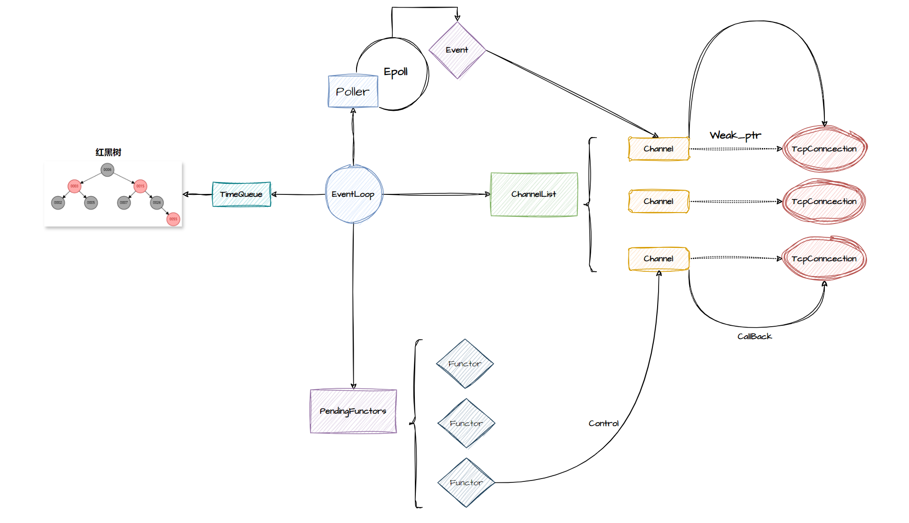

# Bamboo--KV网络服务器
Linux下C++轻量级键值对数据库服务器与客户端

在学习和参考Muduo网络库的基础上，重点实现了**网络模块** 和**日志模块**

存储模块调用了第三方库Leveldb

* 采用**One Loop Per Thread** 的**Multi-Reactors**模式 
    Main Reactor在主线程上监听新连接 
    并将新连接分发给线程池中的Sub Reactor
* 使用Epoll监听套接字上的读写事件 
    使用LT模式多次读取数据，实现低延迟的消息读取
* 基于Linux的timerfd，监听定时器红黑树上的最小节点 
    对上提供更友好的接口，对下融入事件驱动的处理逻辑
* 日志采取前后端分离的设计 
    前端将日志写入Buffer中，后端异步将日志刷新到磁盘 
    通过生产者消费者队列传递Buffer

# 目录
* [目录](#目录)
* [编译运行](#编译运行)
* [快速使用](#快速使用)
* [框架原理](#框架原理)

# 编译运行
## 依赖
1. Leveldb
2. Gtest(测试需要)

## 编译
`cd Bamboo`

`mkdir build && cd build` 

`cmake ..`

`make Server` #生成服务器执行文件

`make Client` #生成客户端执行文件

`./Server` #启动服务器，端口为9981

`./Client` #启动客户端

# 快速使用
1. 帮助信息

2. 选取数据库实例 
服务器初始化时会在当前文件下生成**10**个数据库实例 

3. 键值对操作  

# 框架原理
## 网络模块
### TcpServer
`TcpServer`中`Acceptor`在主线程上不断循环，监听新连接 
将新连接通过轮询的方式的分配给线程池中的Sub Reactor 
并将`TcpConnection`保存在`connections_`中

### EventLoop
`EventLoop`不断调用`Poller::poll()` 获取就绪的网络事件，通过`Channel`执行回调函数 
`EventLoop`持有红黑树管理的定时器，通过Linux的`timerfd`监听定时器红黑树上的最小节点 
通过回调函数队列,实现跨线程操作

## 日志模块
前端将日志写入`Buffer`中，默认将日志输出都控制台 
可通过`Logger::setOutput()`函数将日志输出到日志后端 
通过生产者消费者队列解决多线程日志的线程安全问题
